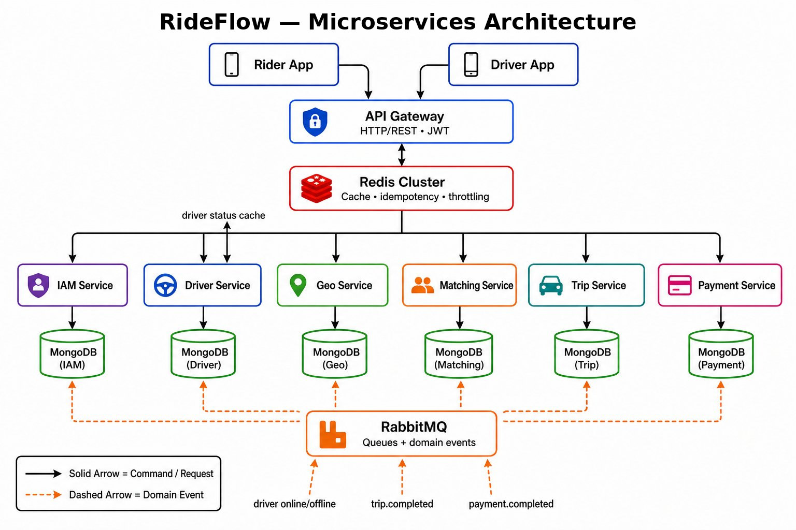
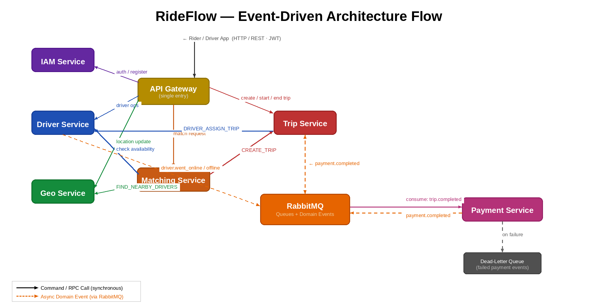
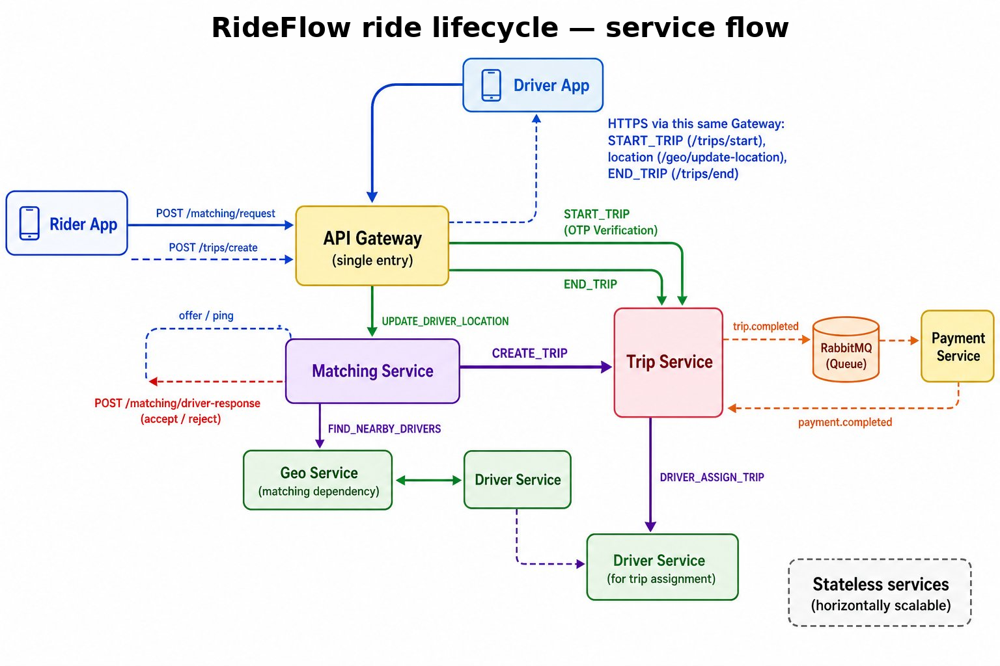

# RideFlow — System Design & Architecture

This repository contains the system design documentation and architectural 
diagrams for the RideFlow ride-hailing backend platform.

---

## Architecture Overview



RideFlow is built as 7 independent microservices, each owning its own 
database and communicating exclusively through RabbitMQ commands and 
async events — no direct service-to-service HTTP calls.

| Service | Responsibility |
|---|---|
| API Gateway | Single entry point — JWT auth, rate limiting, idempotency keys |
| IAM Service | User/driver identity, authentication, JWT issuance |
| Driver Service | Driver availability, state transitions, trip assignment |
| Geo Service | Real-time location tracking, 2dsphere geospatial queries |
| Matching Service | Driver-rider matching, sequential/parallel offer modes |
| Trip Service | Trip lifecycle state machine, OTP verification |
| Payment Service | Billing saga, surge pricing, DLQ fallback |

---

## Event Flow



Services communicate via **RabbitMQ** using two patterns:

**Commands** — direct request to a specific service expecting a response
- Example: API Gateway → Trip Service: `create_trip`

**Async Events** — fire-and-forget notifications other services react to
- Example: Trip Service → Payment Service: `trip.completed`
- Example: Driver Service → Geo Service: `driver.went_online`

Key events in the system:
- `driver.went_online` / `driver.went_offline` — Geo Service updates available pool
- `trip.completed` — Payment Service triggers fare calculation and invoicing
- `payment.completed` — Trip Service updates payment status on the trip

---

## Ride Lifecycle



```
REQUESTED → ASSIGNED → STARTED → COMPLETED
                             ↘ CANCELLED
```

| State | Trigger |
|---|---|
| `REQUESTED` | Rider requests a ride |
| `ASSIGNED` | Matching Service finds and assigns a driver |
| `STARTED` | Driver picks up rider — OTP verified |
| `COMPLETED` | Rider dropped off — payment triggered |
| `CANCELLED` | Trip cancelled at any stage — driver released |

---

## Key Design Decisions

**Event-driven over HTTP** — Services are fully decoupled. A service 
failure doesn't cascade across the system.

**Billing Saga** — `trip.completed` triggers auto-invoicing. 
`payment.completed` updates trip state. Idempotent handlers and a 
Dead-Letter Queue (DLQ) handle failures gracefully.

**Driver Matching** — Supports sequential and parallel offer modes 
with 15s per-driver timeouts. Automatic radius expansion when no 
drivers found in initial radius.

**Surge Pricing** — TTL-cached pricing rules with demand/supply ratio 
sampling. Fare is settled server-side to prevent client manipulation.

**Replay-resistant design** — Idempotency keys on all mutation 
endpoints, JWT auth, and request timestamp skew enforcement at the 
gateway level.

**Event reliability** — `eventId`-based deduplication, configurable 
retry policies with backoff, and dead-letter persistence for manual 
replay and root cause analysis.

---

## Microservice Repositories

| Service | Repository |
|---|---|
| API Gateway | [rideflow-api-gateway](https://github.com/rideflow-backend/rideflow-api-gateway) |
| IAM Service | [rideflow-iam](https://github.com/rideflow-backend/rideflow-iam) |
| Driver Service | [rideflow-driver](https://github.com/rideflow-backend/rideflow-driver) |
| Geo Service | [rideflow-geo](https://github.com/rideflow-backend/rideflow-geo) |
| Matching Service | [rideflow-matching](https://github.com/rideflow-backend/rideflow-matching) |
| Trip Service | [rideflow-trip](https://github.com/rideflow-backend/rideflow-trip) |
| Payment Service | [rideflow-payment](https://github.com/rideflow-backend/rideflow-payment) |
